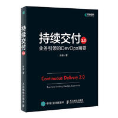

[TOC]

# 1、DevOps实践指南

英文名称：DevOps Handbook

# 2、DevOps实施手册 在多级IT企业中使用DevOps

# 3、凤凰项目 一个IT运维的传奇故事

# 4、持续交付

# 5、持续交付2.0 业务引领的DevOps精要

# 6、目标

# 7、目标Ⅱ——绝不是靠运气

# 8、仍然不足够

# 9、关键链

# 10、抉择

# 11、改变世界的机器

# 12、精益思想

# 13、丰田套路

# 14、丰田模式

# 15、精益产品开发:原则、方法与实施

# 16、Scrum敏捷产品管理

# 17、Scrum精髓

# 18、SRE Google运维揭秘

# 19、Value Stream Mapping

# 20、看板方法

# 21、看板实战

# 22、精益企业

# 23、基础设施即代码

# 24、系统思考

